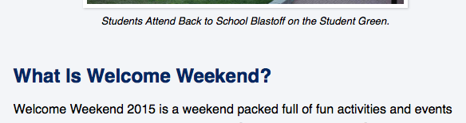
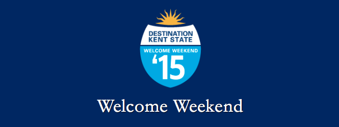
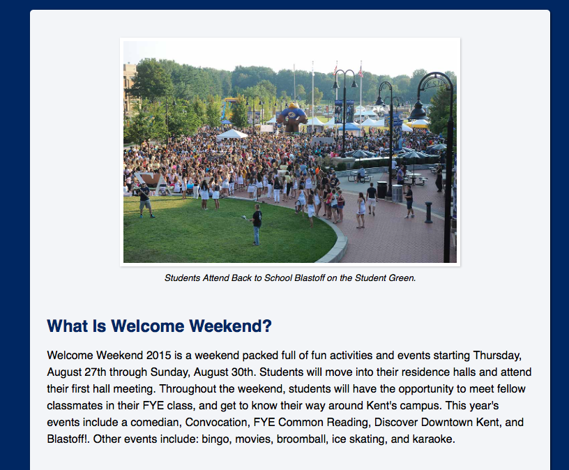
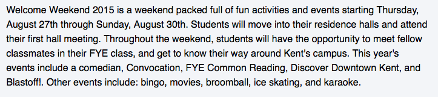
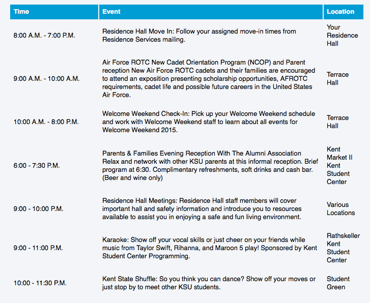
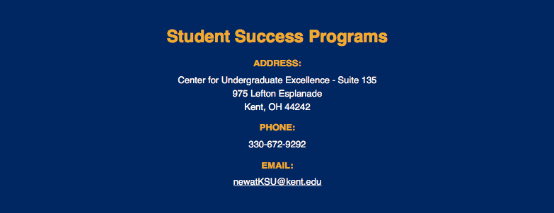

You're happy with the content on your Welcome Weekend website (that you made in HTML 2).  It's time to add some visual styles to the website using CSS.

CodePen makes adding CSS easy because it automatically links your stylesheet to your HTML.  When we begin coding outside of CodePen, you will have to set your CSS using a <link> tag.

<a class="button small" href="/img/css2-assignment-screenshot.png">View Sample Mockup</a>

This is an individual assignment, and it will be turned in via Blackboard Learn.  

**Do not copy and paste another student's code.  If I catch you doing so, you'll receive a 0 for the assignment.**

## What To Do

Open your HTML Basics 2 assignment.  Instead of editing the original pen, click the "Fork" option at the top.  Click Settings and rename the forked pen using this structure: "Your Last Name - CSS Basics 2".

Notice how we've broken the page up into parts.  This is good practice and will help you organize your HTML and CSS better.

---

### Step 1: Add HTML5 Layout Boxes Around Sections

First, we need to add some HTML5 elements to surround our main sections of content and create boxes in the HTML: the header, main content area and footer.  

1.  Surround both the header logo and H1 with a < header > tag.  

2.  Surround the main content with a < main > tag (starting with figure and ending with the embedded video).  

3.  Surround the footer with a < footer > tag, starting with Student Success Programs and ending with the contact information.

---

### Step 2: Global Styles (styles that affect everything)

1.  Make everything on the page a sans-serif typeface of your choosing.  
2. Add a blue background color to the entire page.  Our brand color of blue is rgb(0,38,100).

---

### Step 3: Headings (Typically H2)

<figure class="figure">

</figure>

1. Make the H2's (your subheading styles) the same color blue as the background.  
2. Adjust the margins of your H2's (your subheading styles) so that there is more space above the heading than below the heading.

---

### Step 4: Header (Welcome Weekend)

<figure class="figure">

</figure>

1.  Make your H1 (Welcome Weekend) closely match the screenshot.  You'll have to use font-size, color, letter-spacing, font-family (try Garamond or Georgia) and a text-shadow.
2. Align everything in the header to be centered (hint - use text-align).  
3.  Change all of the text in the header to be colored white.
4. Make the size of the Destination Kent State logo smaller.  We only want to affect that image and not the other images on the page.  We can specifically target an image within the Header using the "header img" selector in our CSS, without affecting other images on the page.  
5.  Give the DKS logo image space on top.  This helps separate it from the top of the page.

---

### Step 5: Main Content Area

<figure class="figure">

</figure>

1. Make the main content area only have a 95% transparent white background color.
2.  Adjust the spacing inside of the main content area so that there is some whitespace.  This might be accomplished with padding.
3.  Set the main content area to a 90% width.  This will give some space around it.
4.  Center the main content area in the middle of the page (hint: use margin: 0 auto).
5.  Tell the main content area to get no wider than 900px (hint use max-width)
6.  Set a slight drop shadow on the main content area

---

### Step 6: Paragraphs

<figure class="figure">

</figure>

1.  Increase the line spacing (leading) on all paragraphs

---

### Step 7: Images and iframes

1. Set all of the images and iframes on the page to be a maximum width of 100% (use max-width) so that they never overflow their container.  This will only be apparent when you resize the window smaller.

---

### Step 8: Blockquote

<figure class="figure">

</figure>

1. Set all blockquote to closely match the screenshot.  You will have to adjust the blockquote's width and center the quote using margin: 0 auto.
2. If your cite tag does not appear inside of the blockquote tag, you have to set cite to display:block in order for it to have a margin and appear on its own line.

---

### Step 9: Figure

<figure class="figure">

</figure>

1. Set the figure (which should contain both the image and caption) to take up 70% of the page as well and center it in the middle of the page.  
2. Add padding to the top and bottom of the figure to space it out away from surrounding elements.
3. Give the photo of welcome weekend (which is the image inside of a figure tag) a 5px white border.  
4. Give the photo of welcome weekend a box shadow.
5. Give the figure's caption margin to space things out away from the image.  
6. Make the caption font italic, aligned to the center and a smaller size.

---

### Step 10: Table

<figure class="figure">

</figure>

1. Make the table have a smaller font size.
2. Give all table cells (TD) padding to space them out.
3. Make the table's header (TH) stand out.  Make the TH elements have a background color of rgb(0,157,216), the text color white, padding to space them out and align the text to the left.

---

### Step 11: Footer

<figure class="figure">

</figure>

1. Now, make the heading in the footer (Student Success Programs) appear in gold: #eaab00.  You'll need to do this by only targeting headings that appear in the footer using "footer h2" in the CSS.
2. Style the DT elements to appear in gold as well, make them uppercase with a smaller font size and bold.
3.  Make the DD Elements have a left margin of 0, a smaller font size and an increased line height.
4. You'll notice that the email address is unreadable because links by default are blue.  To fix this, make all links (a tags) in the footer (using footer a) appear in white.
5. Give the footer padding on the bottom so that there's some breathing room at the end of the window.
6.  Set all of the text in the footer to be centered.

---

### Step 12: Box Sizing

Finally, you'll notice that some of the elements still continue to overflow on small screens.  That's because of the extra padding and borders we've added cause their widths to become greater than 100%.  

1.  To fix this, add this global style to make all boxes take their borders into account when calculating their size.  Use * { box-sizing: border-box; }

---

### Submitting the Assignment

Does everything render correctly?  Your final product should look something close to the sample mockup.

<a class="button small" href="/img/css2-assignment-screenshot.png">View Sample Mockup</a>

1. Once you're satisfied, copy the Editor Mode URL from CodePen
2. Log in to Blackboard Learn to submit your assignment.  Go to Assignments > Assignment Name.  Under Write Submission, Paste the URL of the Pen (Editor Mode).  Click Submit.

## Rubric

Use the following rubric to ensure you receive the highest possible grade for the assignment:

* **3-4**: CSS is written appropriately and with proper indentation.  All steps were followed and correct styles are applied.  Styles are added efficiently, for example, multiple H1 styles are grouped together, as opposed to separate styles for everything.  
* **2**: CSS is mostly structured correctly, but there are some syntax issues (for example, you forgot to close a rule with a semicolon.  Some of the steps were missed.  Similar styles are not grouped together.
* **0 - 1**: CSS does not use appropriate style attributes.  Syntax is incorrect and many of the steps were missed. The pen was not set up or submitted according to instructions.
